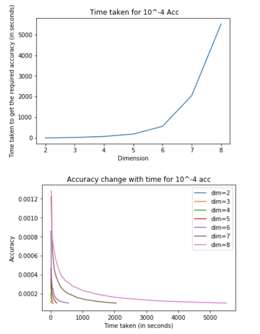
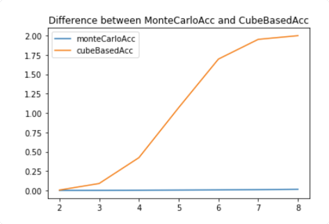

# Monte Carlo Hypersphere Simulation

The project aims to calculate value of pi using MonteCarlo Simulation.

### Monte carlo method
Extending the Buffon laplace method in n dimension, 
we calculate hypersphere volume by generating a random number between -1 to 1 and check if it falls inside the hypersphere.

We do this m times, n trials each. We then use central limit theorem to calculate the confidence interval for our simulation.

#### Results
For higher dimensions, we observe that time taken continuously increases in exponential manner as volume of hypersphere decreases.

### Cube based integration
Break each dimension of cube into n parts, and calculate which part of the cube lies inside the hypersphere. The accuracy would depend on which parts of the hypercube are partially inside the hypersphere.

### Comparison of two methods

We observe that for approximately equal amounts of CPU used, monte carlo returns us better accuracy.

## Use of antithetic variables in monte carlo and calculation of pi.

The method of antithetic random variable utilizes symmetrical characteristic of
symmetry distribution. Here we will generate 4 identical distribution for calculation of pi.

Consider 1/4th part of the circle with x,y in (0,1).
From this part, area of the circle = pi/4. Area of the square surrounding it = 1.
Thus we can estimate the value of pi from this setup using Monte Carlo.   

Now Consider three other distributions between ((0,1),(0,-1)),((0,-1),(0,-1)),((0,-1),(0,1))
Since the unit sphere is symmetrical in all four axis, All of the four distributions will give identical results. Thus all the datapoints can be assumed to be observed four times.

This would help us in reducing variance thus helping us reaching the confidence interval fastest.

#### Results

For same number of simulations, we see that our value of pi becomes 4 times more precise on using antithetic variables.